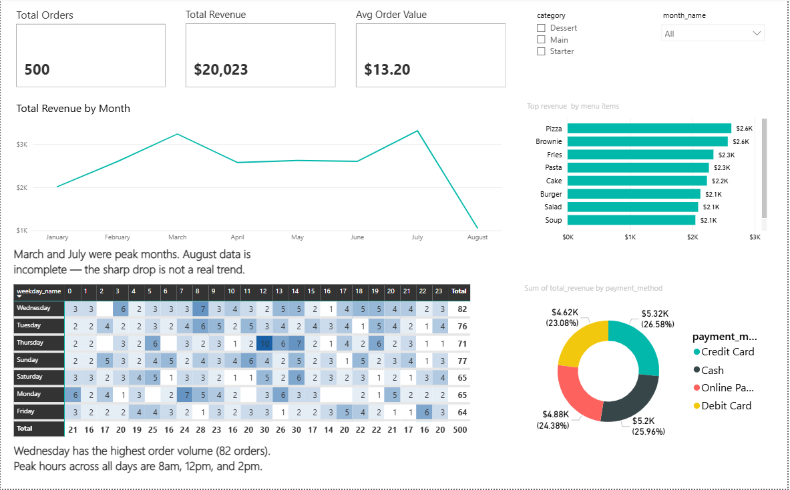

# restaurant-sales-analysis
SQL + Power BI dashboard analyzing restaurant sales, revenue trends, and order patterns
# Restaurant Sales Analysis

## Overview
End-to-end data analysis project using SQL and Power BI 
to analyze 500 restaurant transactions across 9 menu items,
4 payment methods, and 8 months of data.

## Tools Used
- SQL Server — data cleaning and preparation
- Power BI — interactive dashboard
- CSV — raw source data

## What I Did
- Imported raw CSV data into SQL Server
- Cleaned and enriched data with calculated columns
  (total_revenue, order_hour, day_of_week, month_name)
- Created a clean view for Power BI to connect to
- Built an interactive dashboard with slicers,
  KPI cards, trend analysis, and heatmap matrix

## Key Findings
- Total revenue: $20,023 across 500 orders
- March and July were peak months (32% of revenue)
- Pizza and Brownie are top items ($2.6K each)
- Wednesday has highest order volume (82 orders)
- Peak hours: 8am, 12pm, and 2pm
- All 4 payment methods are nearly equal (~25% each)

## Dashboard
[View live dashboard](https://app.powerbi.com/groups/me/reports/2c949b8b-9c65-4a54-9b2c-e1f85130f514/0c619deef85a1f1342d1?experience=power-bi)

